
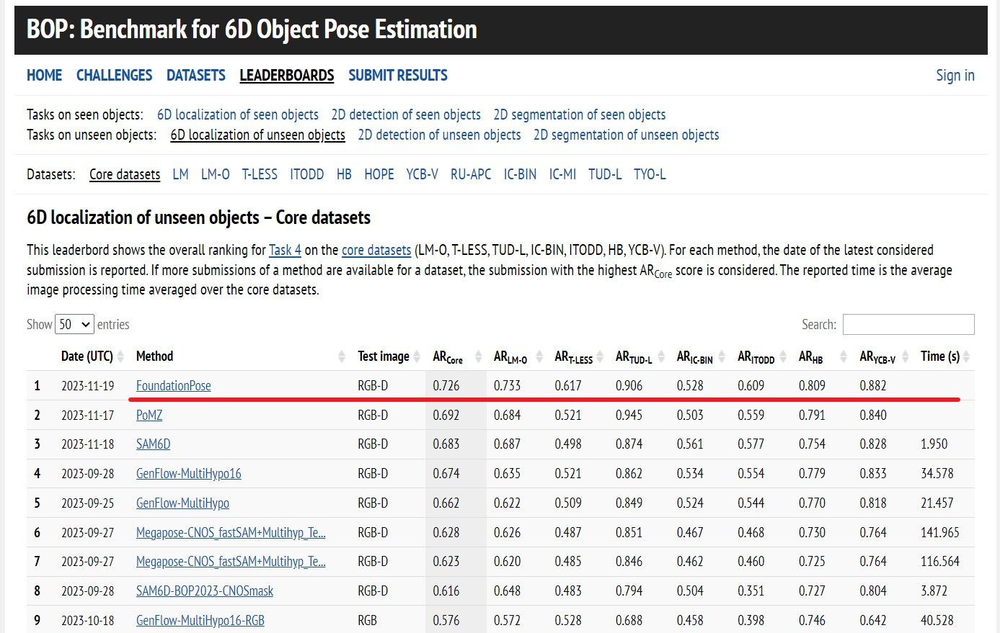
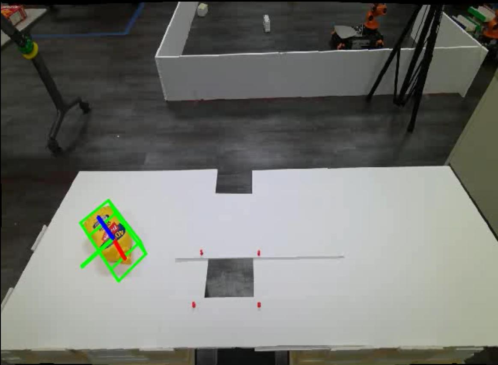
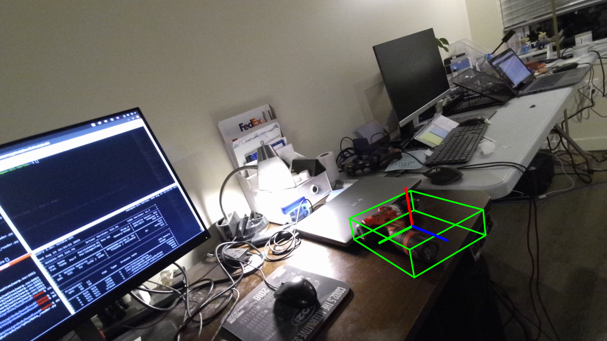
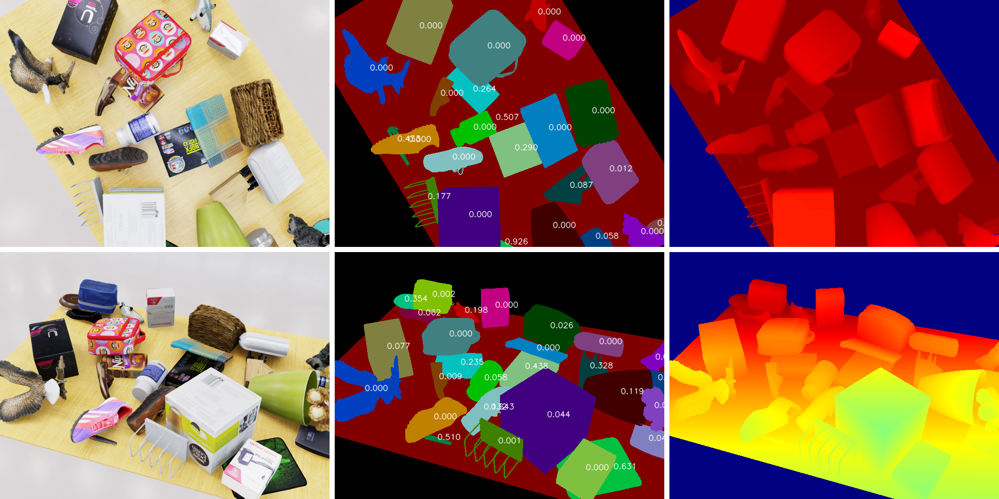
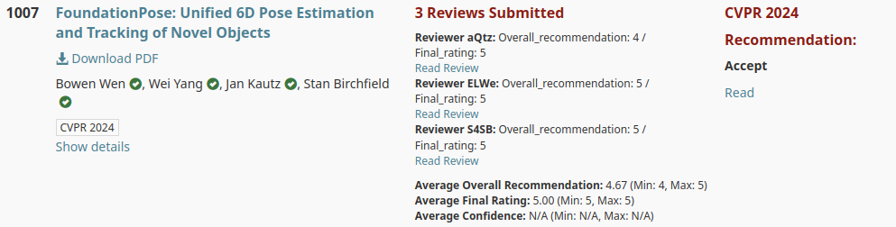

# FoundationPose：面向新物体的统一 6D 位姿估计与跟踪

[[论文]](https://arxiv.org/abs/2312.08344) [[项目网站]](https://nvlabs.github.io/FoundationPose/)

> 本文是 [英文 README](readme.md) 的中文翻译，依据本地仓库提交 `a1b694b`。命令、示例代码和链接保留原文内容；版本兼容性及安装步骤以原项目后续更新为准。

这是我们发表于 CVPR 2024、入选 Highlight 的论文的官方实现。

贡献者：Bowen Wen、Wei Yang、Jan Kautz、Stan Birchfield。

我们提出了 FoundationPose，一个用于物体 6D 位姿估计与跟踪的统一基础模型，同时支持基于模型（model-based）和无模型（model-free）两种设置。只要提供物体的 CAD 模型，或采集少量参考图像，就可以在测试时直接将该方法应用于新物体，无需微调。我们使用支持高效新视角合成的神经隐式表示，衔接这两种设置，使下游位姿估计模块在统一框架下保持不变。借助大语言模型（LLM）、新型 Transformer 架构和对比学习方法，我们通过大规模合成数据训练获得了较强的泛化能力。在多个包含复杂场景和物体的公开数据集上进行的广泛评估表明，我们的统一方法显著优于针对各项任务专门设计的现有方法。此外，即使所需的前提条件更少，该方法也能取得与实例级方法相当的结果。



**🤖 如需 ROS 版本，请参阅 [Isaac ROS Pose Estimation](https://github.com/NVIDIA-ISAAC-ROS/isaac_ros_pose_estimation)，该版本支持 TensorRT（TRT）快速推理和 C++ 加速。**

**🥇 截至 2024 年 3 月，在基于模型的新物体位姿估计任务中，位列全球 [BOP 排行榜](https://bop.felk.cvut.cz/leaderboards/pose-estimation-unseen-bop23/core-datasets/)第一。**



## 演示

机器人应用：

https://github.com/NVlabs/FoundationPose/assets/23078192/aa341004-5a15-4293-b3da-000471fd74ed

增强现实（AR）应用：

https://github.com/NVlabs/FoundationPose/assets/23078192/80e96855-a73c-4bee-bcef-7cba92df55ca

在 YCB-Video 数据集上的结果：

https://github.com/NVlabs/FoundationPose/assets/23078192/9b5bedde-755b-44ed-a973-45ec85a10bbe

# 文献引用（BibTeX）

```bibtex
@InProceedings{foundationposewen2024,
author        = {Bowen Wen, Wei Yang, Jan Kautz, Stan Birchfield},
title         = {{FoundationPose}: Unified 6D Pose Estimation and Tracking of Novel Objects},
booktitle     = {CVPR},
year          = {2024},
}
```

如果无模型设置对你有所帮助，也请考虑引用：

```bibtex
@InProceedings{bundlesdfwen2023,
author        = {Bowen Wen and Jonathan Tremblay and Valts Blukis and Stephen Tyree and Thomas M\"{u}ller and Alex Evans and Dieter Fox and Jan Kautz and Stan Birchfield},
title         = {{BundleSDF}: {N}eural 6-{DoF} Tracking and {3D} Reconstruction of Unknown Objects},
booktitle     = {CVPR},
year          = {2023},
}
```

# 数据准备

1. 从[此处](https://drive.google.com/drive/folders/1DFezOAD0oD1BblsXVxqDsl8fj0qzB82i?usp=sharing)下载所有网络权重，并放到 `weights/` 文件夹下。位姿细化网络（refiner）需要 `2023-10-28-18-33-37`，评分网络（scorer）需要 `2024-01-11-20-02-45`。

2. [下载演示数据](https://drive.google.com/drive/folders/1pRyFmxYXmAnpku7nGRioZaKrVJtIsroP?usp=sharing)，并解压到 `demo_data/` 文件夹下。

3. 【可选】下载我们的大规模训练数据：[FoundationPose Dataset](https://drive.google.com/drive/folders/1s4pB6p4ApfWMiMjmTXOFco8dHbNXikp-?usp=sharing)。

4. 【可选】从[此处](https://drive.google.com/drive/folders/1PXXCOJqHXwQTbwPwPbGDN9_vLVe0XpFS?usp=sharing)下载预处理后的参考视图，用于运行无模型的少样本版本。

# 环境配置方案一：Docker（推荐）

```bash
cd docker/
docker pull wenbowen123/foundationpose && docker tag wenbowen123/foundationpose foundationpose  # Or to build from scratch: docker build --network host -t foundationpose .
bash docker/run_container.sh
```

上面命令中的注释说明，也可以使用 `docker build --network host -t foundationpose .` 从头构建镜像。

> 译注：以上命令按原文保留。原文先执行 `cd docker/`，随后又使用 `docker/run_container.sh`，存在相对路径重复的问题。若已进入 `docker/` 目录，应执行 `bash run_container.sh`；若位于仓库根目录，则执行 `bash docker/run_container.sh`。

首次启动容器时，需要编译扩展。请在 Docker 容器**内部**运行：

```bash
bash build_all.sh
```

之后可以直接进入容器，无需重新编译：

```bash
docker exec -it foundationpose bash
```

对于 RTX 4090 等较新的 GPU，请参阅[此问题讨论](https://github.com/NVlabs/FoundationPose/issues/27)。简而言之，执行：

```bash
docker pull shingarey/foundationpose_custom_cuda121:latest
```

然后修改 bash 脚本，将使用的镜像由 `foundationpose:latest` 替换为上述镜像。

# 环境配置方案二：Conda（本地）

1. **创建环境**：包含 C++ 编译依赖和 Python，均来自 `conda-forge`。

```bash
conda env create -f environment.yml
conda activate foundationpose
```

2. **安装 PyTorch**：选择与你的机器相匹配的 CUDA 构建版本。[PyTorch 入门页面](https://pytorch.org/get-started/locally/)列出了相应的 `--index-url`。原文举例指出，`cu124` 可用于大多数当时的 NVIDIA 驱动。示例：

```bash
python -m pip install torch torchvision torchaudio --index-url https://download.pytorch.org/whl/cu124
```

3. **安装 PyTorch3D 和 NVDiffRast**：需要从源码编译，并通过 CUDA Toolkit 提供 `nvcc`。将 `CUDA_HOME` 指向你的 CUDA 安装目录，例如 `/usr/local/cuda-12.8` 或 `/usr/local/cuda`。

```bash
export CUDA_HOME=/usr/local/cuda   # or e.g. /usr/local/cuda-12.8
export PATH="$CUDA_HOME/bin:$PATH"
python -m pip install --no-build-isolation "git+https://github.com/facebookresearch/pytorch3d.git"
python -m pip install --no-build-isolation "git+https://github.com/NVlabs/nvdiffrast.git"
```

必须使用 `--no-build-isolation`，这样构建过程才能访问已经安装的 `torch`。

4. **安装其余 Python 依赖并编译 `mycpp` 扩展**：BundleSDF 的 `mycuda` 编译步骤是可选的；除非需要无模型 / NeRF 流程，否则可以跳过。

```bash
python -m pip install -r requirements.txt
bash build_all_conda.sh
```

5. **可选：Kaolin**。仅无模型设置需要，其版本必须与你的 PyTorch/CUDA 版本匹配，详见 [Kaolin 安装文档](https://kaolin.readthedocs.io/en/latest/notes/installation.html)。

# 运行基于模型的演示

代码已在 `argparse` 中设置默认路径。如果需要更换场景，可以传入相应参数。使用演示数据运行后，你应该能看到机器人操作芥末瓶的过程。程序在第一帧进行位姿估计，随后自动切换到跟踪模式，处理视频中的其余帧。可视化结果会保存到 `argparse` 中指定的 `debug_dir` 目录。（注意：由于运行时编译，首次运行可能较慢。）

```bash
python run_demo.py
```



你也可以通过修改 `argparse` 中的路径，尝试电钻等其他物体，**无需重新训练**。



# 在公开数据集上运行（LINEMOD、YCB-Video）

首先需要下载 LINEMOD 和 YCB-Video 数据集。

要分别在这两个数据集上运行基于模型的版本，请根据实际下载位置设置路径。结果会保存到 `debug` 文件夹。

```bash
python run_linemod.py --linemod_dir /mnt/9a72c439-d0a7-45e8-8d20-d7a235d02763/DATASET/LINEMOD --use_reconstructed_mesh 0

python run_ycb_video.py --ycbv_dir /mnt/9a72c439-d0a7-45e8-8d20-d7a235d02763/DATASET/YCB_Video --use_reconstructed_mesh 0
```

要运行无模型的少样本版本，需要先训练神经物体场（Neural Object Field）。`ref_view_dir` 应指向前面“数据准备”部分下载的参考视图所在目录。将 `dataset` 参数设置为你想使用的数据集。

```bash
python bundlesdf/run_nerf.py --ref_view_dir /mnt/9a72c439-d0a7-45e8-8d20-d7a235d02763/DATASET/YCB_Video/bowen_addon/ref_views_16 --dataset ycbv
```

随后，对基于模型版本的命令做少量修改后运行。以下以 YCB-Video 为例：

```bash
python run_ycb_video.py --ycbv_dir /mnt/9a72c439-d0a7-45e8-8d20-d7a235d02763/DATASET/YCB_Video --use_reconstructed_mesh 1 --ref_view_dir /mnt/9a72c439-d0a7-45e8-8d20-d7a235d02763/DATASET/YCB_Video/bowen_addon/ref_views_16
```

# 常见问题排查

- 对于 RTX 4090 等较新的 GPU，请参阅[此问题讨论](https://github.com/NVlabs/FoundationPose/issues/27)。
- 如需在 Windows 上配置环境，请参阅[此问题讨论](https://github.com/NVlabs/FoundationPose/issues/148)。
- 如果得到的结果不合理，请查看[此回复](https://github.com/NVlabs/FoundationPose/issues/44#issuecomment-2048141043)和[这份使用手册](https://github.com/030422Lee/FoundationPose_manual)。

# 训练数据下载

我们的训练数据包含使用 GSO 和 Objaverse 三维资产构建的场景，采用高质量、照片级真实感渲染，并进行了大范围的域随机化。每个数据样本都包含 **RGB 图像、深度、物体位姿、相机位姿、实例分割和二维边界框**。[[Google Drive 下载]](https://drive.google.com/drive/folders/1s4pB6p4ApfWMiMjmTXOFco8dHbNXikp-?usp=sharing)



解析相机参数（包括外参和内参）的示例：

```python
glcam_in_cvcam = np.array([[1,0,0,0],
                        [0,-1,0,0],
                        [0,0,-1,0],
                        [0,0,0,1]]).astype(float)
W, H = camera_params["renderProductResolution"]
with open(f'{base_dir}/camera_params/camera_params_000000.json','r') as ff:
  camera_params = json.load(ff)
world_in_glcam = np.array(camera_params['cameraViewTransform']).reshape(4,4).T
cam_in_world = np.linalg.inv(world_in_glcam)@glcam_in_cvcam
world_in_cam = np.linalg.inv(cam_in_world)
focal_length = camera_params["cameraFocalLength"]
horiz_aperture = camera_params["cameraAperture"][0]
vert_aperture = H / W * horiz_aperture
focal_y = H * focal_length / vert_aperture
focal_x = W * focal_length / horiz_aperture
center_y = H * 0.5
center_x = W * 0.5

fx, fy, cx, cy = focal_x, focal_y, center_x, center_y
K = np.eye(3)
K[0,0] = fx
K[1,1] = fy
K[0,2] = cx
K[1,2] = cy
```

> 译注：以上代码按原文保留。如果单独运行，需要先导入 `numpy as np` 和 `json`，设置 `base_dir`，并将 `W, H = camera_params["renderProductResolution"]` 移至读取 JSON、赋值 `camera_params` 之后，以免在变量定义前使用它。

# 说明

由于在 LAION 数据集上训练的 Stable Diffusion 所涉及的法律限制，我们无法发布基于扩散模型进行纹理增强的数据，也无法发布使用这些数据训练的预训练权重。因此，我们发布的是未使用扩散增强数据训练的版本，预计性能会略有下降。

# 致谢

感谢 Jeff Smith 协助发布代码；感谢 NVIDIA Isaac Sim 和 Omniverse 团队对合成数据生成的支持；感谢 Tianshi Cao 提供的宝贵讨论。最后，也感谢 CVPR 审稿人和领域主席（AC）给予的积极反馈与建设性建议。



# 许可证

代码和数据依据 NVIDIA Source Code License 发布。版权所有 © 2024 NVIDIA Corporation。保留所有权利。

# 联系方式

如有问题，请联系 [Bowen Wen](https://wenbowen123.github.io/)。
